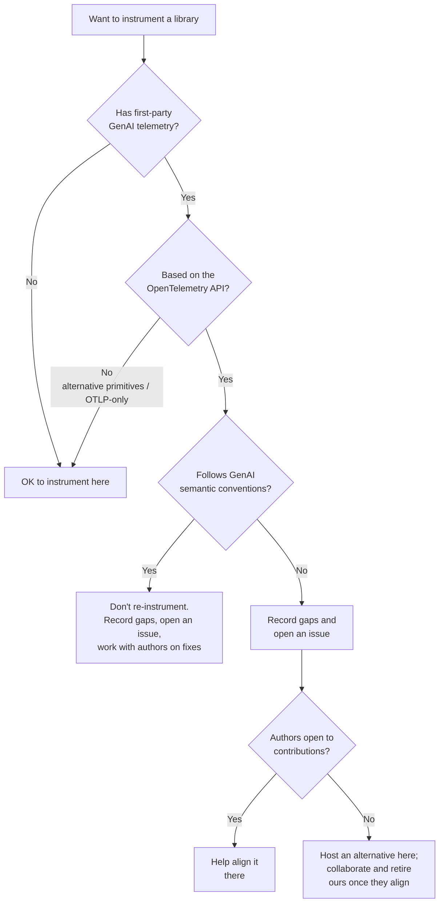

# Contributing

Welcome to the OpenTelemetry Python GenAI Instrumentations repository!

New to OpenTelemetry? Read the
[New Contributor Guide](https://github.com/open-telemetry/community/blob/main/guides/contributor/README.md)
first — it covers the CLA, Code of Conduct, and other prerequisites.

If you are using AI agents to assist with contributions, please also read
[AGENTS.md](AGENTS.md) for guidance on how to use them responsibly in this
project.

## Prerequisites

- [Python](https://www.python.org/downloads/) — see [`tox.ini`](tox.ini) for
  the supported versions.
- [`uv`](https://docs.astral.sh/uv/getting-started/installation/) — used to
  manage the workspace and to back the `tox` test environments.

## Code structure

```
├── instrumentation/
│   └── opentelemetry-instrumentation-genai-<name>/  # one package per GenAI library
│       ├── src/opentelemetry/instrumentation/genai/<name>/
│       ├── tests/
│       ├── CHANGELOG.md
│       └── pyproject.toml
└── util/
    └── opentelemetry-util-genai/              # shared GenAI utilities
        ├── src/opentelemetry/util/genai/
        ├── tests/
        ├── CHANGELOG.md
        └── pyproject.toml
```

The monorepo uses `uv` workspaces; each package owns its own `pyproject.toml`,
version, and entry points. `tox.ini` defines the test matrix.

## Package naming and versioning

Instrumentation packages are named `opentelemetry-instrumentation-genai-<name>` and import as
`opentelemetry.instrumentation.genai.<name>` — for example,
`opentelemetry-instrumentation-genai-anthropic` imports
`opentelemetry.instrumentation.genai.anthropic`. 

Packages use the OpenTelemetry beta versioning format — `MAJOR.MINORbN` (e.g. `1.0b0`). `version.py` carries a `.dev`
suffix during development (`1.0b0.dev`); the release workflow drops it.

## Making a change

### 1. Set up the environment

Install all packages and dev tools into a single workspace virtual environment:

```sh
uv sync --frozen --all-packages
```

### 2. Lint

```sh
uv run pre-commit run ruff --all-files
```

### 3. Test

Run the test environment for the package you changed (append `-oldest` or
`-latest` for the version variants defined in `tests/requirements.{oldest,latest}.txt`):

```sh
uv run tox -e py312-test-instrumentation-genai-openai-latest
```

Run type checking across the workspace:

```sh
uv run tox -e typecheck
```

#### Managing cassettes (test recordings)

GenAI tests replay recorded HTTP interactions (cassettes) stored under each
package's `tests/cassettes/`.

- **Run**: nothing extra — cassettes replay automatically when present. Tests
  that need a cassette skip if it is missing and no real API key is set.
- **Record**: delete the target `tests/cassettes/<test_name>.yaml`, export a
  real provider API key (e.g. `OPENAI_API_KEY`, `ANTHROPIC_API_KEY`), and
  rerun the test. `pytest-vcr` writes the cassette on the live call.
- **Sanitize**: every package's `vcr_config()` in `tests/conftest.py` must
  scrub auth via `filter_headers` and strip identifying response headers via
  `scrub_response_headers(...)` from `opentelemetry.test_util_genai.vcr`.
  Diff each new cassette before committing — leaked API keys, org ids, or
  `Set-Cookie` values block the PR.
- **AI-generated cassettes**: if you lack provider access, you may
  synthesize a cassette from the provider's API reference via AI. Add a
  `# TODO: this is generated by AI, re-record` comment at the top of the
  cassette, mention it in the PR, and open a follow-up issue to re-record it
  in CI against the real provider.
- **CI**: replay-only; recording in CI is a future improvement.

### 4. Update the changelog

This repo uses [towncrier](https://towncrier.readthedocs.io/) to manage
changelogs. Each PR with user-visible impact must add a changelog fragment
under the affected package's `.changelog/` directory rather than editing
`CHANGELOG.md` directly.

**Fragment path:** `<package>/.changelog/<PR_NUMBER>.<TYPE>`

**Types:** `added`, `changed`, `deprecated`, `removed`, `fixed`.

The file contains a one-line description. For example,
`instrumentation/opentelemetry-instrumentation-genai-anthropic/.changelog/123.fixed`:

```
fix request hook not being called when stream=True
```

Don't include the PR number in the body — towncrier appends it from the
filename.

Preview the rendered changelogs locally:

```sh
uv run tox -e changelog-preview
```

If your change doesn't need an entry (pure docs/tooling), add the
`Skip Changelog` label to the PR.

## Skills

This repo ships skills (under `.github/skills/`) that automate the heavy,
repeatable contribution flows. Trigger them deliberately when
you start one of these tasks:

- [**`migrate-from-openinference`**](.github/skills/migrate-from-openinference/SKILL.md) — migrate an `openinference-instrumentation-*`
  package into this repo as an OTel GenAI package, or augment an existing
  package with the coverage OpenInference adds on top.
- [**`review-migration`**](.github/skills/review-migration/SKILL.md) — review a ported or augmented package against its
  upstream implementation and write `MIGRATION_REPORT.md`.
- [**`write-conformance-tests`**](.github/skills/write-conformance-tests/SKILL.md) — author conformance scenarios and the
  `test_conformance.py` runner for an instrumentation package.

Please contribute back anything you learn while using the skills that could help improve them!

## When to add an instrumentation here

> [!IMPORTANT]
> We encourage libraries to emit GenAI telemetry themselves, following the
> [GenAI semantic conventions](https://github.com/open-telemetry/semantic-conventions-genai),
> either with [native instrumentation](https://opentelemetry.io/docs/specs/otel/glossary/#natively-instrumented)
> (using the OpenTelemetry API directly) or through a first-party plugin. 
> Telemetry is best owned and maintained closest to the library it
> describes; When native instrumentation is available, re-instrumenting here 
> fragments the ecosystem.

Some existing first-party telemetry is not compatible with OpenTelemetry - for
example, it may use tracing primitives not based on the OpenTelemetry API,
export via OTLP only without interacting with OpenTelemetry context and SDK
configuration, or not follow the GenAI semantic conventions.

Before adding a new instrumentation, check whether the target library already
emits first-party GenAI telemetry (built in, or through a first-party plugin),
whether it's based on the OpenTelemetry API, and how closely it follows the
GenAI semantic conventions:

- **None exists, or it isn't based on the OpenTelemetry API** (alternative
  tracing primitives, OTLP-only, no OTel context) - proceed with instrumentation
  in this repo.
- **It exists and is reasonably compliant** - don't re-instrument here. Record
  any gaps and open an issue in the corresponding repo, and work with the authors
  to contribute fixes there if they're open to it.
- **It's based on the OpenTelemetry API but doesn't follow the GenAI semantic
  conventions** - record the gaps and open an issue in the corresponding repo.
  If the authors are open to contributions, help align it there. If not, note in
  the issue that we intend to host an alternative instrumentation in
  OpenTelemetry, that we're happy to collaborate, and that we'll be happy to
  retire ours once it aligns.



This isn't a one-time check. If a library we already instrument later ships
compatible native instrumentation or a first-party plugin, we should consider
retiring ours.

The absence of compatible native instrumentation is just one factor. Whether we
add an instrumentation here also depends on things like the library's popularity
and whether it's actively maintained.

## Which operations an instrumentation should emit

An instrumentation emits telemetry only for the operations the library itself
performs. Two principles:

- **Don't re-emit another library's telemetry.** If the library delegates an
  operation to another instrumentable library (for example a framework that
  calls `openai`, `anthropic`, or `google-genai` under the hood), instrumentation
  for that operation belongs to the underlying library, and the two correlate
  through standard context propagation.
- **Emit an operation only when the library has that concept.** Emit inference or
  embeddings only when the library is itself the model-call boundary, an
  `invoke_agent` span only when it models agents, an `invoke_workflow` span only
  when it models workflows or graphs, `execute_tool` only when it runs the tool
  itself, and so on. Calling the provider's REST API directly (with no separate
  instrumentable client library in between) makes the library the model-call
  boundary, so it is a valid reason to emit inference.

Agent-framework instrumentation SHOULD NOT emit inference spans by default; the
underlying LLM library owns them. The exception is a framework that issues the
model call in a way no other instrumentable library can observe — it calls the
REST API directly, embeds a vendored model library, or similar. In that case the
framework is the only place the inference call is visible, so it SHOULD emit the
span.

## Keep PRs small

One logical change per PR. Don't bundle unrelated fixes, refactors, or
features — split them so each can be reviewed and reverted independently.
Small, focused PRs are much easier to review, and therefore much more
likely to land quickly.

If a PR review surfaces contentious or difficult points, consider splitting
those into follow-up PRs so the uncontroversial parts can land and each of
the harder points gets its own focused discussion and review.

## Asking questions

Post in
[#otel-genai-instrumentation](https://cloud-native.slack.com/archives/C06KR7ARS3X)
on [CNCF Slack](https://slack.cncf.io/) or join the next
[GenAI SIG](https://github.com/open-telemetry/community#sig-genai-instrumentation)
meeting and add your topic to the
[meeting agenda](https://docs.google.com/document/d/1EKIeDgBGXQPGehUigIRLwAUpRGa7-1kXB736EaYuJ2M).
See the [community repo](https://github.com/open-telemetry/community#sig-genai-instrumentation)
for current meeting times.

## Approvers and Maintainers

### Maintainers

- [Trask Stalnaker](https://github.com/trask), Microsoft
- [Liudmila Molkova](https://github.com/lmolkova)
- [Aaron Abbott](https://github.com/aabmass), Google

For more information about the maintainer role, see the [community repository](https://github.com/open-telemetry/community/blob/main/guides/contributor/membership.md#maintainer).

### Approvers

- [Dylan Russell](https://github.com/DylanRussell), Google
- [Mike Goldsmith](https://github.com/MikeGoldsmith), Honeycomb
- [Keith Decker](https://github.com/keith-decker), Cisco
- [Leighton Chen](https://github.com/lzchen), Microsoft

For more information about the approver role, see the [community repository](https://github.com/open-telemetry/community/blob/main/guides/contributor/membership.md#approver).

